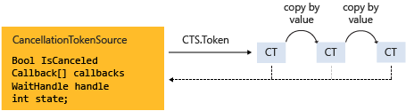

## Cancellation Tokens (aka anulowanie wątków)
Mechanizm wykorzystywany do przerywania operacji asynchronicznych (chociaż nie tylko).
### Ogólna zasada implementacji
- Zainicjalizuj CancellationTokenSource, który utworzy nam token i będzie odpowiedzialny za jego anulowanie
- Przekaż token za pomocą property CancellationTokenSource.Token do każdego tasku lub wątku, który będzie nasłuchiwać anulowania (nazwijmy takie obiekty listenerami)
- Zaimplementuj w każdym obiekcie korzystającym z Tokena jakiś mechanizm, który będzie reagować na anulowanie
- Wykorzystaj CancellationTokenSource.Cancel do propagacji przerwania




.NET udostępnia trzy typy służace do anulowania wątków:
- CancellationTokenSource - Obiekt odpowiedzialny za tworzenie tokena oraz anulowanie wszystkich jego kopii
- CancellationToken - struktura (yes it is a struct :p), której używają listenery do monitorowanie aktualnego stanku tokena
- OperationCancelledException

Każdy z obiektów do którego został przekazany token, może opcjonalnie wyrzucić powyższy wyjątek za pomocą: 
```csharp
token.ThrowIfCancellationRequested();
```

## Trochę faktów
- Cancellation Token nie wymusza na listenerze żadnych akcji. Jest to jedynie mechanizm, który powiadamia o przerwaniu. Obiekt wykorzystujący token - listener - sam reaguje na przerwanie
- Tylko obiekt Invoku'jący operacje możliwe później do anulowania, jest w stanie wykonać przerwanie - jest to obiekt który ma w posiadaniu CTS. Listenerzy nie są w stanie anulować tokena
- [Listener może połączyć parę tokenów w jeden] (###Łączenie-Tokenów)
- Listenerzy są w stanie sprawdzić stan tokena za pomocą polling'u, callbacka, bądź wait handle*
- Kod użytkownika może zauważyć żądania anulowania z kodu biblioteki i odpowiedzieć na nie, a kod biblioteki może zauważyć i reagować na żądania anulowania z kodu użytkownika **
  
*tego tematu nie poruszam bo jest dość zawiły i długi, polecam sprawdzić poniższe linki:
  https://www.albahari.com/threading/part2.aspx#_Signaling_with_Event_Wait_Handles

https://learn.microsoft.com/en-us/dotnet/standard/threading/how-to-listen-for-cancellation-requests-that-have-wait-handles
https://learn.microsoft.com/en-us/dotnet/api/system.threading.manualreseteventslim?view=net-6.0


**
Metody udstępnione przez biblioteke, które można anulować, powinny również udostępnić możliwość przekzania zewnętrznego tokenu usera
np.:
```csharp
/// Kod prostego .NETowego HttpClient'a posiada dodatkowy parametr CancellationToken dzięki ktoremu programista może przekazać własny token 
public Task<HttpResponseMessage> GetAsync (string? requestUri, System.Threading.CancellationToken cancellationToken);

/// Oczywiście jest dostępna także metoda bez użycia tokena
```

Natomiast jeżeli kod biblioteki wywołuje kod programisty, kod biblioteki powinien obłużyć wyjątek **OperationCanceledException**


### Łączenie Tokenów

```csharp
// Create a new token that combines the internal and external tokens.
   this.internalToken = internalTokenSource.Token;
   this.externalToken = externalToken;

   using (CancellationTokenSource linkedCts =
           CancellationTokenSource.CreateLinkedTokenSource(internalToken, externalToken))
   {
       try {
           DoWorkInternal(linkedCts.Token);
       }
       catch (OperationCanceledException) {
           if (internalToken.IsCancellationRequested) {
               Console.WriteLine("Operation timed out.");
           }
           else if (externalToken.IsCancellationRequested) {
               Console.WriteLine("Cancelling per user request.");
               externalToken.ThrowIfCancellationRequested();
           }
       }
   }
```


### Polling
```csharp
static void NestedLoops(Rectangle rect, CancellationToken token)
{
   for (int x = 0; x < rect.columns && !token.IsCancellationRequested; x++) {
      for (int y = 0; y < rect.rows; y++) {
         // Simulating work.
         Thread.SpinWait(5000);
         Console.Write("{0},{1} ", x, y);
      }

      // Assume that we know that the inner loop is very fast.
      // Therefore, checking once per row is sufficient.
      if (token.IsCancellationRequested) {
         // Cleanup or undo here if necessary...
         Console.WriteLine("\r\nCancelling after row {0}.", x);
         Console.WriteLine("Press any key to exit.");
         // then...
         break;
         // ...or, if using Task:
         // token.ThrowIfCancellationRequested();
      }
   }
}
```

Jest to w zasadzie wykorzystanie warości pola CancellationToken.IsCancellationRequested.

### Callback
```csharp
using System;
using System.Net;
using System.Threading;

class Example
{
    static void Main()
    {
        CancellationTokenSource cts = new CancellationTokenSource();

        StartWebRequest(cts.Token);

        // cancellation will cause the web
        // request to be cancelled
        cts.Cancel();
    }

    static void StartWebRequest(CancellationToken token)
    {
        WebClient wc = new WebClient();
        wc.DownloadStringCompleted += (s, e) => Console.WriteLine("Request completed.");

        // Cancellation on the token will
        // call CancelAsync on the WebClient.
        token.Register(() =>
        {
            wc.CancelAsync();
            Console.WriteLine("Request cancelled!");
        });

        Console.WriteLine("Starting request.");
        wc.DownloadStringAsync(new Uri("http://www.contoso.com"));
    }
}
```

Metoda **Register** pozwala na zarejestrowania delegata, który będzie wykonany po tym jak Token zostanie anulowany.

### Krótka lista dobrych praktyk
- Dobrą praktyką przy projektowaniu interfejsów jest wprowadzenie opcjonalnego parametru dla Cancel Tokenu np.:
```csharp
public interface IHttpClient
{
    Task<Response> GetAsync(string url, CancellationToken cancellationToken = default);
}

/// W takim wypadku nie trzeba się też martiwić o to
public Task<Response> GetAsync(tring url, CancellationToken cancellationToken = default)
{
    // że w tym miejscu otrzymamy wyjątek NullRefExc, gdyż default of struct nie jest nullem
    cancellationToken.ThrowIfCancellationRequested();
}
```


### Polecana literatura

[Polecane Patterny wykorzystania tokena](https://devblogs.microsoft.com/premier-developer/recommended-patterns-for-cancellationtoken/)

[Cancellation Tokeny w ASP MVC](https://andrewlock.net/using-cancellationtokens-in-asp-net-core-mvc-controllers/)